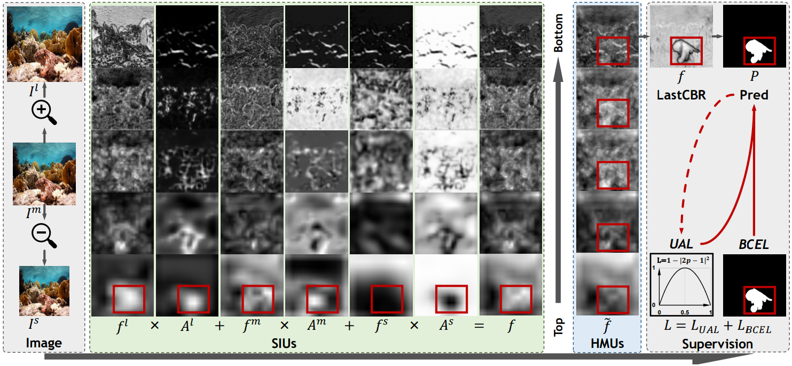
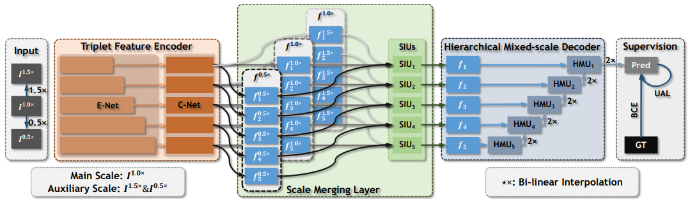
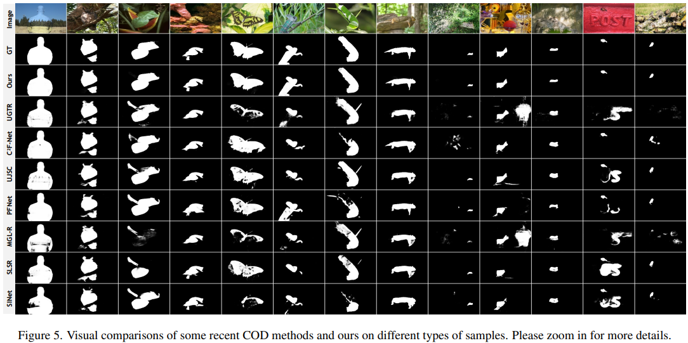
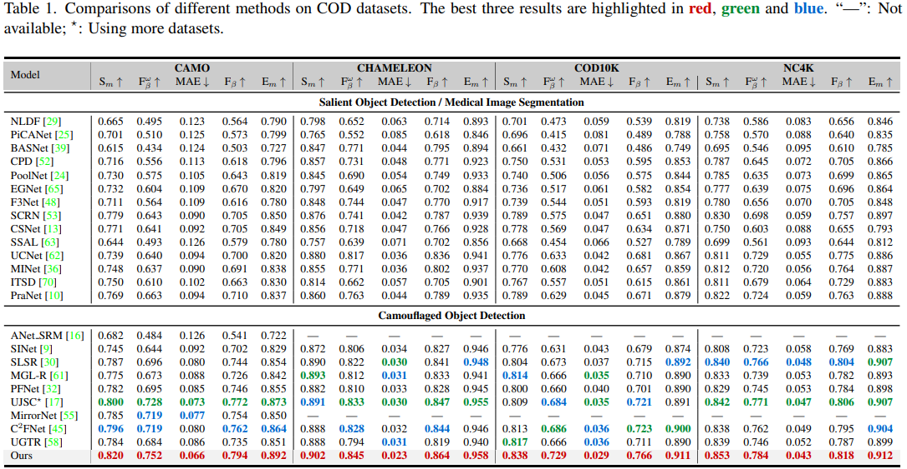
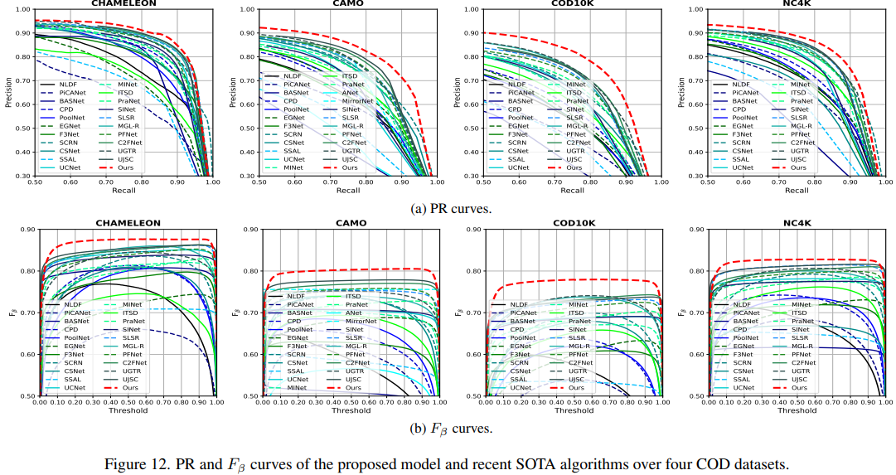
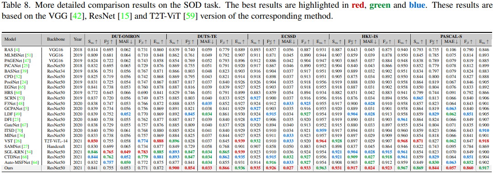
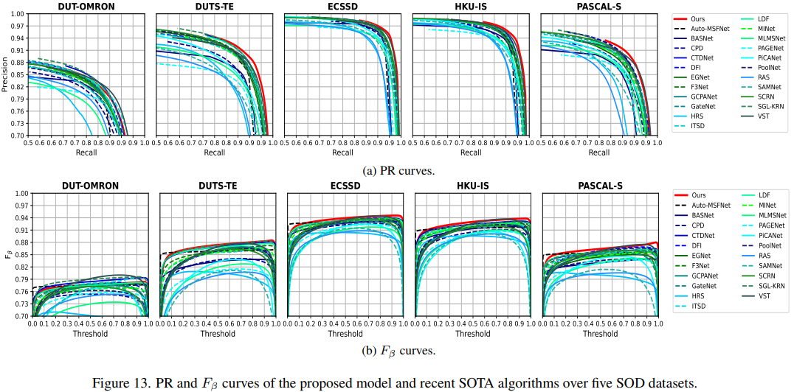

# (CVPR 2022) Zoom In and Out: A Mixed-scale Triplet Network for Camouflaged Object Detection

[](https://opensource.org/licenses/MIT)


[](https://arxiv.org/abs/2203.02688)
[](https://github.com/lartpang/ZoomNet/releases/download/v0.0.1/zoomnet-arxiv.pdf)

```
@inproceedings{ZoomNet-CVPR2022,
	title     = {Zoom In and Out: A Mixed-scale Triplet Network for Camouflaged Object Detection},
	author    = {Pang, Youwei and Zhao, Xiaoqi and Xiang, Tian-Zhu and Zhang, Lihe and Lu, Huchuan},
	booktitle = CVPR,
	year      = {2022}
}
```

**Extensions to the conference version can be found: <https://github.com/lartpang/ZoomNeXt>.**

## Changelog

* 2022-3-16
    - Add the link of the method prediction maps of Table 1 in our paper.
* 2022-03-08
    - Add the link of arxiv version.
* 2022-03-07
    - Add the link of paper.
* 2022-03-05:
    - Update weights and results links.
    - Fixed some bugs.
    - Update dataset links.
    - Update bibtex info.
* 2022-03-04:
    - Initialize the repository.
    - Add the model and configuration file for SOD.

## Usage

### Dependencies

Some core dependencies:

- timm == 0.4.12
- torch == 1.8.1
- [pysodmetrics](https://github.com/lartpang/PySODMetrics) == 1.2.4 # for evaluating results

More details can be found in <./requirements.txt>

### Datasets

More details can be found at:
- COD Datasets: <https://github.com/lartpang/awesome-segmentation-saliency-dataset#camouflaged-object-detection-cod>
- SOD Datasets: <https://github.com/lartpang/awesome-segmentation-saliency-dataset#rgb-saliency>

### Training

You can use our default configuration, like this:

```shell
$ python main.py --model-name=ZoomNet --config=configs/zoomnet/zoomnet.py --datasets-info ./configs/_base_/dataset/dataset_configs.json --info demo
```

or use our launcher script to start the one command in `commands.txt` on GPU 1:

```shell
$ python tools/run_it.py --interpreter 'abs_path' --cmd-pool tools/commands.txt  --gpu-pool 1 --verbose --max-workers 1
```

If you want to launch multiple commands, you can use it like this:

1. Add your commands into the `tools/commands.txt`.
2. `python tools/run_it.py --interpreter 'abs_path' --cmd-pool tools/commands.txt --gpu-pool <gpu indices> --verbose --max-workers max_workers`

**NOTE**:

- `abs_path`: the absolute path of your python interpreter
- `max_workers`: the maximum number of tasks to start simultaneously.

### Testing

| Task | Weights                                                                                                                           | Results                                                                                                       |
| ---- | --------------------------------------------------------------------------------------------------------------------------------- | ------------------------------------------------------------------------------------------------------------- |
| COD  | [GitHub Release Link](https://github.com/lartpang/ZoomNet/releases/download/v0.0.1/cod_zoomnet_r50_bs8_e40_2022-03-04.pth)        | [GitHub Release Link](https://github.com/lartpang/ZoomNet/releases/download/v0.0.1/CVPR-2022-ZoomNet-COD.zip) |
| SOD  | [GitHub Release Link](https://github.com/lartpang/ZoomNet/releases/download/v0.0.1/sod_zoomnet_r50_bs22_e50_2022-03-04_fixed.pth) | [GitHub Release Link](https://github.com/lartpang/ZoomNet/releases/download/v0.0.1/CVPR-2022-ZoomNet-SOD.zip) |

For ease of use, we create a `test.py` script and a use case in the form of a shell script `test.sh`.

```shell
$ sudo chmod +x ./test.sh
$ ./test.sh 0  # on gpu 0
```

### Method Comparisons

- The prediction maps corresponding to the methods in Table 1 of our paper:
    - Baidu Pan: <https://pan.baidu.com/s/1dLMqa4tix1gdBN1uWrCPbQ> Code: yxy9
- PySODEvalToolkit: A Python-based Evaluation Toolbox for Salient Object Detection and Camouflaged Object Detection
    - <https://github.com/lartpang/PySODEvalToolkit>

## Paper Details

### Method Detials





### Comparison

#### Camouflaged Object Detection







#### Salient Object Detection




